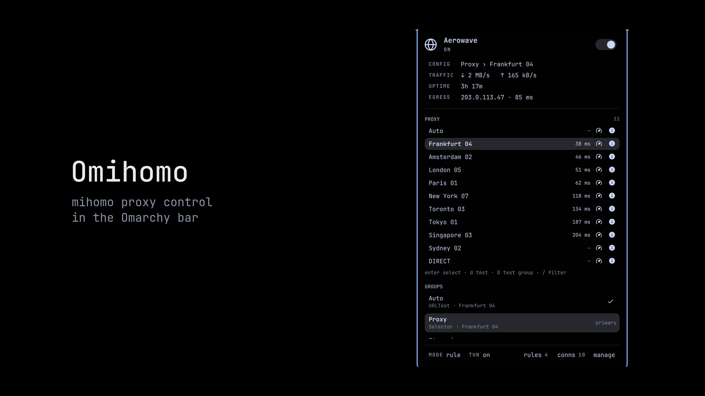

# Omihomo

An Omarchy 4 bar widget for the [mihomo](https://wiki.metacubex.one) proxy core. Add a
subscription, pick a config, flip TUN, watch live connections, all from the bar. Underneath sits a
small bash CLI that owns the core's install, its systemd user unit, and everything that touches
disk.



## Requirements

- Omarchy 4 on Arch Linux
- `yay`, to build `mihomo-bin` from the AUR
- A mihomo-compatible subscription URL, or a Mihomo YAML config you host yourself

`omihomo core install` pulls the rest through pacman: `go-yq`, `jq`, `nftables`, and `curl`. Arch's
`yq` package is a jq wrapper that owns the same `/usr/bin/yq` as `go-yq`, so if you have it
installed the CLI asks pacman to replace it and tells you before it does.

## Install

```sh
omarchy plugin add https://github.com/readeem/omihomo.git --enable
omarchy bar move dev.readeem.omihomo
```

The plugin ships without the core. Click the bar icon and run the panel's install action, which
opens a floating terminal for the AUR build, or run `omihomo core install` yourself.

## Use

Left click opens the panel, right click starts or stops the core, middle click refreshes. Inside
the panel `j`/`k` move, `enter` activates, and single letters do the rest. `s` core, `t` TUN, `m`
mode, `c` connections, `a` add subscription, `n` new rule, `d` latency.

Subscription URLs may return a full Mihomo YAML config or a raw share-link format that your
installed Mihomo version understands. Raw subscriptions get one generated `Proxy` selector and a
final `MATCH,Proxy` rule.

Everything the panel does is also a CLI verb. See [docs/cli.md](docs/cli.md) for the full list and
[docs/widget.md](docs/widget.md) for how the panel is put together.

## What it changes on your system

Omihomo is a proxy manager, so it needs more than a config file. All of it is listed here:

| Change | Where | Made by |
| --- | --- | --- |
| `mihomo-bin` package | AUR via `yay` | `core install` |
| `go-yq`, `jq`, `nftables`, `curl` | pacman | `core install` |
| setuid+setgid root on `/usr/bin/mihomo` | `chmod 6755` | `core install`, `core repair` |
| pacman hook that reapplies those bits after a mihomo upgrade | `/usr/share/libalpm/hooks/omihomo-permissions.hook` | `core install`, `core repair` |
| systemd user unit for the core | `~/.config/systemd/user/omihomo.service` | `core install` |
| CLI symlink | `~/.local/bin/omihomo` | `core install` |
| subscriptions, configs, rules, cache | `~/.local/share/omihomo/` | every write verb |
| proxy env for tailscaled | `/etc/systemd/system/tailscaled.service.d/omihomo.conf` | `set tailscale on` only |

The root work lives in one file, [libexec/root.sh](libexec/root.sh), with a fixed set of actions.
It runs through `sudo` from a terminal and `pkexec` from the panel, and it installs no sudoers
policy. mihomo runs setuid root because TUN needs it, which is
[ADR-0006](docs/adr/0006-tun-via-setuid-root.md); the file capabilities Omihomo used before are
[ADR-0002](docs/adr/0002-tun-via-file-capabilities.md), and the grant path still clears them.

Omihomo never writes to your Hyprland, shell, or terminal config.

## Remove

```sh
omihomo core uninstall          # add --keep-data to spare subscriptions and cache
omarchy plugin remove dev.readeem.omihomo
```

`core uninstall` stops and deletes the systemd unit, drops the setuid bits and the pacman hook,
removes the tailscaled drop-in, removes the `~/.local/bin/omihomo` symlink, uninstalls
`mihomo-bin`, and deletes `~/.local/share/omihomo`. It leaves `go-yq`, `jq`, `nftables`, and
`curl` alone, since your system probably wanted those anyway.

Run it before removing the plugin. The uninstall verb lives in the plugin directory, so removing
the plugin first leaves the unit and the setuid bits behind.

## Settings

One setting, exposed in Omarchy's plugin settings: `refreshIntervalSec`, how often the bar polls
core status. Default 10, range 2 to 3600. That poll runs whether the panel is open or not. The
mihomo API reads behind live traffic, latency, and connections only run while the panel is open,
and the connections view drops to 2 seconds while you are looking at it.

The CLI reads a handful of environment variables for people with unusual setups, including
`OMIHOMO_USER_AGENT` for subscription servers that content-negotiate on it, and
`OMIHOMO_TAILSCALE_PORT`. They are declared at the top of [lib/common.sh](lib/common.sh).

## Development

Link a checkout into Omarchy's user plugin directory instead of installing from git:

```sh
ln -sfn "$(pwd)" ~/.config/omarchy/plugins/dev.readeem.omihomo
omarchy plugin enable dev.readeem.omihomo
omarchy bar move dev.readeem.omihomo
omarchy restart shell
```

Omarchy loads the checkout directly, so saved changes reload with `omarchy restart shell`. Confirm
the plugin was found:

```sh
omarchy plugin list --json | jq '.[] | select(.id == "dev.readeem.omihomo")'
```

Unlink without deleting the checkout:

```sh
rm ~/.config/omarchy/plugins/dev.readeem.omihomo
```

`tests/run` runs both suites, the bash CLI tests and the QML service tests. Neither touches the
real service, the real config, or the network.

```text
Panel.qml, Service.qml, Model.js, OmihomoIcon.qml   the bar widget
bin/omihomo, libexec/, lib/                          the CLI
tests/run                                            both test suites
docs/                                                CLI and widget reference, ADRs
```

## License

MIT. See [LICENSE](LICENSE).

Omihomo installs and drives mihomo but does not bundle or redistribute it. mihomo is GPL-3.0 and
comes from the AUR as `mihomo-bin`.
