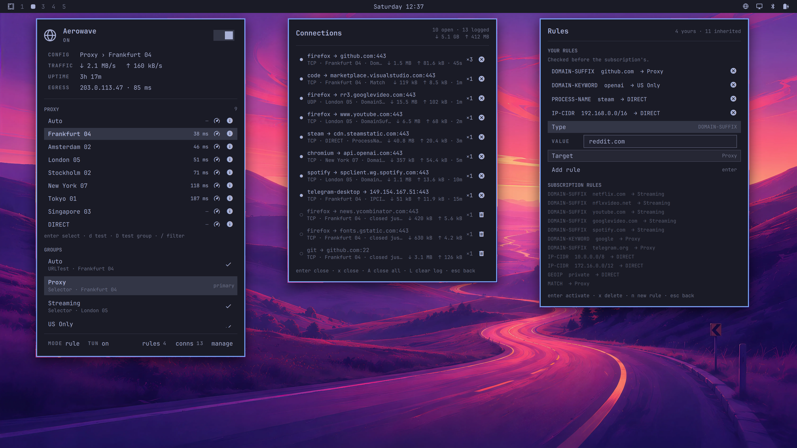
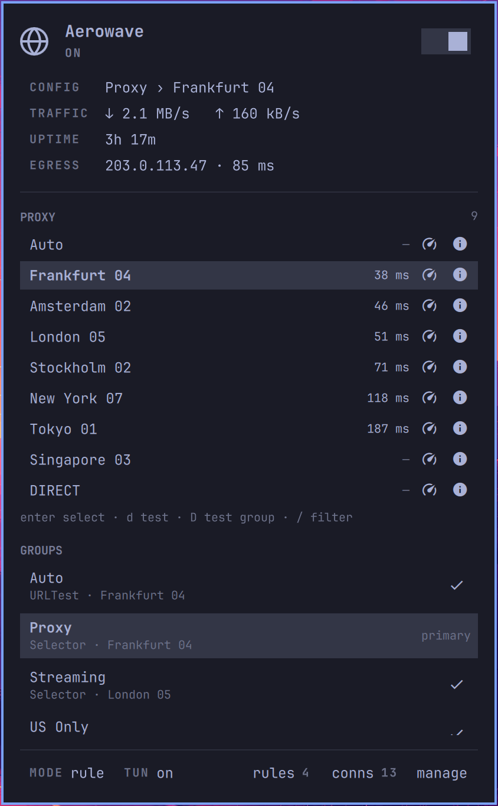
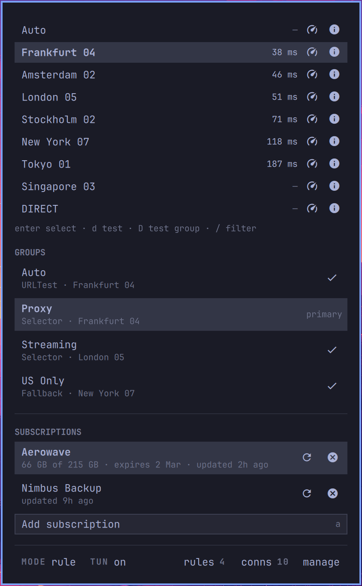
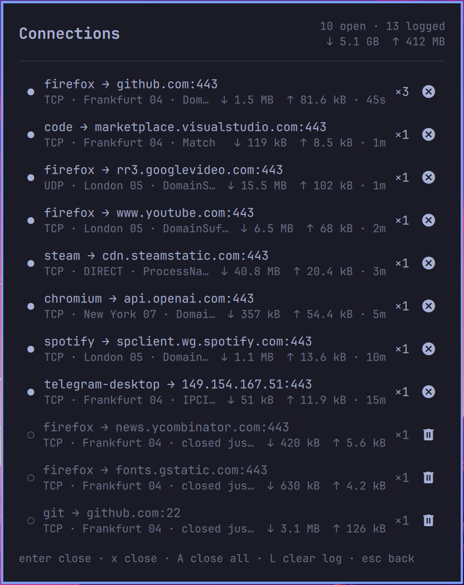
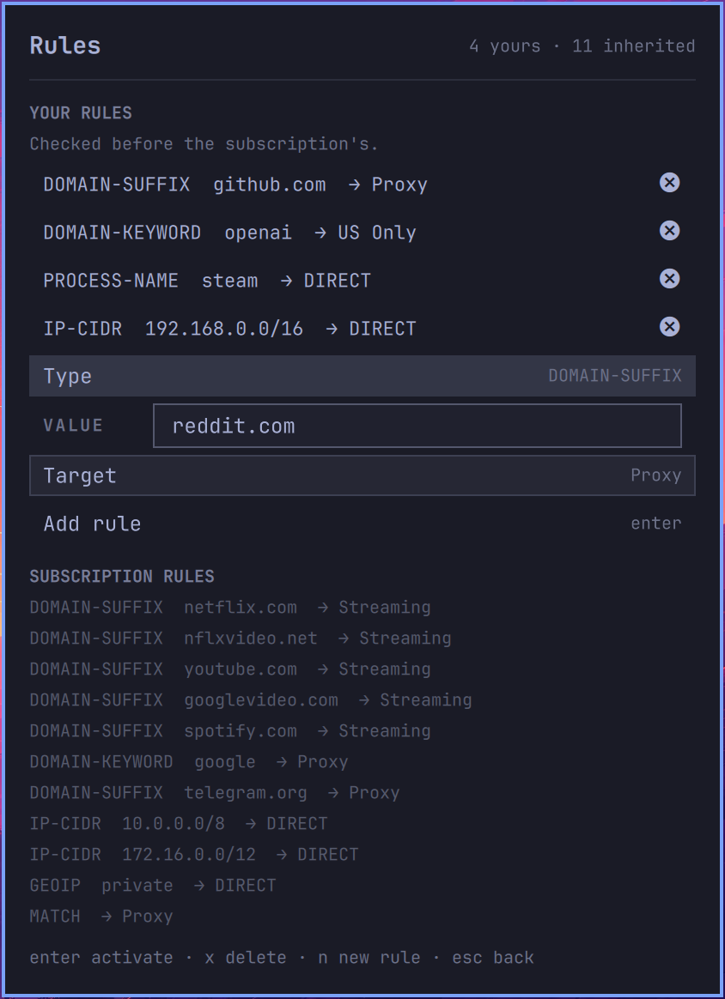
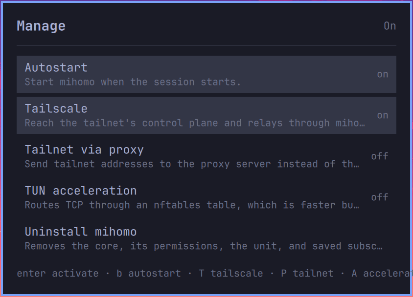

<div align="center">

<h1>
  
  Omihomo
</h1>

**The [mihomo](https://wiki.metacubex.one) proxy core, run from the Omarchy bar.**

Subscriptions, groups, latency, rules, TUN, and live connections, one keypress away.

[](https://omarchy.org)
[](manifest.json)
[](LICENSE)



</div>

## Features

- **One-click core.** Start, stop, and install mihomo from the bar. The icon dims when the core is off.
- **Subscriptions.** Paste a URL, and Omihomo imports it, names it, and refreshes it on the provider's schedule.
- **Groups and configs.** Pick a config, latency-test one or a whole group, and choose the primary group.
- **Live readout.** Throughput, uptime, and the egress IP with its round trip through the selected config.
- **Connections log.** Open and recently closed connections, grouped by process and destination. Close one stack or all of them.
- **Your rules first.** Add `DOMAIN-SUFFIX`, `DOMAIN-KEYWORD`, `IP-CIDR`, and `PROCESS-NAME` rules that apply before the subscription's own rules.
- **TUN, mode, Tailscale.** Toggle TUN, cycle rule, global, and direct mode, and route the tailnet through the proxy.
- **Keyboard first.** `j`/`k` walk the whole panel, and every action has a single-letter key.
- **Scriptable.** Everything the panel does is also an `omihomo` CLI verb.

## Screenshots

<table>
  <tr>
    <td align="center" width="33%"><br><sub>Status, configs, and groups</sub></td>
    <td align="center" width="33%"><br><sub>Subscriptions with quota and expiry</sub></td>
    <td align="center" width="33%"><br><sub>Connections log</sub></td>
  </tr>
  <tr>
    <td align="center"><br><sub>Your rules and the subscription's</sub></td>
    <td align="center"><br><sub>Autostart, Tailscale, and TUN acceleration</sub></td>
    <td></td>
  </tr>
</table>

## Requirements

- Omarchy 4 on Arch Linux
- `yay`, to build `mihomo-bin` from the AUR
- A mihomo-compatible subscription URL, or a mihomo YAML config you host yourself

`omihomo core install` installs the rest with pacman: `go-yq`, `jq`, `nftables`, and `curl`. Arch's
`yq` package is a jq wrapper that owns the same `/usr/bin/yq` as `go-yq`. If you have it installed,
the CLI tells you and then asks pacman to replace it.

## Install

```sh
omarchy plugin add https://github.com/readeem/omihomo.git --enable
omarchy bar move dev.readeem.omihomo
```

The plugin does not include the core. Click the bar icon and run the panel's install action, which
opens a floating terminal for the AUR build, or run `omihomo core install` yourself.

## Usage

| Input | Action |
| --- | --- |
| Left click | Open the panel |
| Right click | Start or stop the core |
| Middle click | Refresh |
| `j` / `k`, `enter` | Move, activate |
| `s` / `t` / `m` | Core on/off, TUN, mode |
| `a` / `n` | Add subscription, new rule |
| `d` / `D` | Latency test a config, a whole group |
| `c` / `M` | Connections view, manage view |
| `/` | Filter configs |

The full key map is in [docs/widget.md](docs/widget.md#keys), and every CLI verb is in
[docs/cli.md](docs/cli.md).

### Subscriptions

A subscription URL may return a full mihomo YAML config, or a raw share-link format that your
installed mihomo version understands. A raw subscription gets one generated `Proxy` selector and a
final `MATCH,Proxy` rule.

<details>
<summary><b>Automatic refresh</b></summary>

<br>

Subscriptions refresh on the interval in the provider's `Profile-Update-Interval` header (a
positive whole number of hours). When the header is missing or invalid, the interval is 12 hours.
The interval counts from the last successful download, including manual updates. Time while the
computer is off or asleep counts too, so an overdue subscription refreshes on the first check after
login or resume.

Checks run every minute, even with the panel closed or the core stopped. A refresh keeps the core's
running or stopped state, mode, and TUN state, and the selected configs that still exist in their
groups. A failed download keeps the previous configuration and retries on the next check.

Each successful import or update records the interval and its timestamp, so a provider can change
the interval in any response. A failed update keeps both previous values. Every download and
controller call has its own timeout. The batch as a whole has none, so a slow subscription cannot
stop later ones from being checked.

`core install` enables the user timer, and `core sync` adds it to existing installs when the
updated widget loads. To turn automatic refresh off or back on:

```sh
systemctl --user disable --now omihomo-subscription-update.timer
systemctl --user enable --now omihomo-subscription-update.timer
```

</details>

<details>
<summary><b>Ports and DNS defaults</b></summary>

<br>

A subscription without an inbound gets `mixed-port: 7890`. Omihomo sets DNS to `redir-host` mode,
with Cloudflare DNS-over-HTTPS through the primary proxy group. Proxy-server and DNS-server
hostnames resolve through direct Cloudflare DoH, so connecting to the proxy never depends on the
proxy itself. Resolver settings and DNS modes you set in `override.yaml` take precedence.

</details>

## What it changes on your system

A proxy manager needs more than a config file. This is everything Omihomo changes:

| Change | Where | Made by |
| --- | --- | --- |
| `mihomo-bin` package | AUR via `yay` | `core install` |
| `go-yq`, `jq`, `nftables`, `curl` | pacman | `core install` |
| setuid+setgid root on `/usr/bin/mihomo` | `chmod 6755` | `core install`, `core repair` |
| pacman hook that reapplies those bits after a mihomo upgrade | `/usr/share/libalpm/hooks/omihomo-permissions.hook` | `core install`, `core repair` |
| systemd user unit for the core | `~/.config/systemd/user/omihomo.service` | `core install` |
| subscription refresh service and timer | `~/.config/systemd/user/omihomo-subscription-update.{service,timer}` | `core install`, first `core sync` after upgrade |
| CLI symlink | `~/.local/bin/omihomo` | `core install` |
| subscriptions, configs, rules, cache | `~/.local/share/omihomo/` | every write verb |
| proxy env for tailscaled | `/etc/systemd/system/tailscaled.service.d/omihomo.conf` | `set tailscale on` only |

All root work lives in one file, [libexec/root.sh](libexec/root.sh), which accepts a fixed set of
actions. It runs through `sudo` from a terminal and `pkexec` from the panel, and Omihomo installs no
sudoers policy. mihomo runs setuid root because TUN needs it
([ADR-0006](docs/adr/0006-tun-via-setuid-root.md)). Omihomo used file capabilities before
([ADR-0002](docs/adr/0002-tun-via-file-capabilities.md)), and granting permissions still clears
them.

Omihomo never writes to your Hyprland, shell, or terminal config.

## Settings

Omarchy's plugin settings expose one option, `refreshIntervalSec`: how often the bar polls core
status. The default is 10 seconds, and the range is 2 to 3600. That poll runs whether the panel is
open or not. The mihomo API reads behind live traffic, latency, and connections run only while the
panel is open, and the connections view polls every 2 seconds while it is on screen.

The CLI reads a few environment variables for unusual setups, such as `OMIHOMO_USER_AGENT` for
subscription servers that respond differently by user agent, and `OMIHOMO_TAILSCALE_PORT`. They
are listed at the top of [lib/common.sh](lib/common.sh).

## Remove

```sh
omihomo core uninstall          # add --keep-data to keep subscriptions and cache
omarchy plugin remove dev.readeem.omihomo
```

Run `core uninstall` before removing the plugin. The uninstall verb lives in the plugin directory,
so removing the plugin first leaves the unit and the setuid bits behind.

`core uninstall` stops and deletes the core unit and the subscription refresh units, drops the
setuid bits and the pacman hook, removes the tailscaled drop-in and the `~/.local/bin/omihomo`
symlink, uninstalls `mihomo-bin`, and deletes `~/.local/share/omihomo`. It leaves `go-yq`, `jq`,
`nftables`, and `curl` installed, since other software probably uses them.

## Development

<details>
<summary><b>Run from a checkout</b></summary>

<br>

Link a checkout into Omarchy's user plugin directory instead of installing from git:

```sh
ln -sfn "$(pwd)" ~/.config/omarchy/plugins/dev.readeem.omihomo
omarchy plugin enable dev.readeem.omihomo
omarchy bar move dev.readeem.omihomo
omarchy restart shell
```

Omarchy loads the checkout directly, so `omarchy restart shell` picks up saved changes. Confirm
that Omarchy found the plugin:

```sh
omarchy plugin list --json | jq '.[] | select(.id == "dev.readeem.omihomo")'
```

Unlink without deleting the checkout:

```sh
rm ~/.config/omarchy/plugins/dev.readeem.omihomo
```

</details>

`tests/run` runs the bash CLI tests and the QML service tests. Neither touches the real service,
the real config, or the network. See [tests/README.md](tests/README.md).

```text
Panel.qml, Service.qml, Model.js, OmihomoIcon.qml   the bar widget
bin/omihomo, libexec/, lib/                          the CLI
tests/                                               both test suites
docs/                                                CLI and widget reference, ADRs
```

## License

MIT. See [LICENSE](LICENSE).

Omihomo installs and drives mihomo but does not bundle or redistribute it. mihomo is licensed under
GPL-3.0 and comes from the AUR as `mihomo-bin`.
